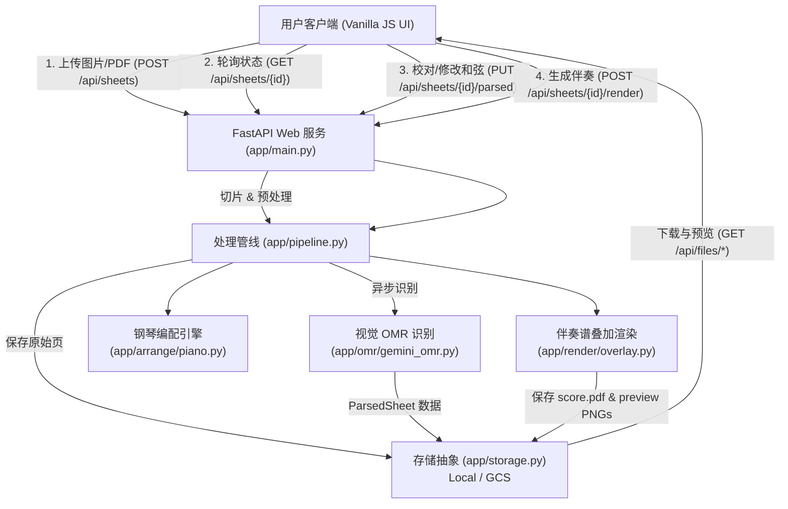

# 台湾谱伴奏生成器 (Taiwanese Band Chart Accompaniment Generator)

一个将台湾流行乐队简谱（台湾谱：简谱旋律 + 框选级数和弦如 `1(2)`、`5/7`、`2m7/5` + 编曲织体标记）自动转换为专业钢琴即兴伴奏乐谱与 PDF 的全栈 Web 应用。

## 系统架构 (Architecture)



## 功能特点 (Features)

- **多页乐谱上传**：支持 JPG、PNG、WEBP 及 PDF（PyMuPDF 自动在 200 DPI 下切片，长边自动下采样至 ≤ 2400px）。
- **智能 OMR 识别**：后台异步调用多模态模型识别曲名、曲风、速度、调号、小节线及级数和弦。
- **质量校验防护与版面门禁 (QA Guardrails & Layout Gate)**：OMR 识别后自动进行级数和弦语法与异常校验；若版面置信度过低（`< 0.6`）或存在大量未确认的结构划分问题，启动版面门禁并在前端阻断生成、后端返回 HTTP 409，需经人工确认后方可放行。
- **差异化在线校对与原图比对 (Interactive Review & Lightbox)**：针对和弦语法/疑义、小节线划分、转调定位、旋律拍数不符等不同异常类型自动渲染专用核对卡片；包含整行系统小节线标出、和弦红框裁剪、备选按钮与自由输入；点击原谱裁剪即可唤起支持缩放与平移的高清 Lightbox。
- **颗粒度确认接口 (Confirm API)**：提供 `POST /api/sheets/{id}/confirm` 接口，支持对单一或批量存疑项一键确认、选择候选或更正小节数，自动同步至伴奏生成附录页。
- **多调性与多难度**：支持原调/男调/女调快速切换与 12 调下拉选择；初级、中级（推荐）、高级三种织体难度。
- **PDF 校验附录页**：若乐谱存在校对或自动修正项，自动在伴奏谱末尾附加“校验说明”附录页方便演奏者核对。
- **免二次上传重生成**：可直接在生成结果页面切换调号或难度，一键重新生成伴奏谱。

## 本地开发 (Local Development)

### 环境依赖

- Python 3.12+
- 虚拟环境已包含在 `.venv` 中

### 运行测试

```bash
.venv/bin/python -m pytest tests/test_api.py -q
```

### 启动本地服务

```bash
LOCAL_STORAGE_DIR=out/local .venv/bin/uvicorn app.main:app --port 8765 --reload
```

访问 `http://localhost:8765/` 打开前端交互界面，或访问 `http://localhost:8765/healthz` 检查健康状态。

## 云端部署 (Cloud Run Deployment)

项目使用 `deploy.sh` 一键发布至 Google Cloud Run (`asia-east1`)：

- **自动化配置**：自动创建 GCS 存储桶并配置 30 天自动清理生命周期；自动配置具有 `roles/aiplatform.user` 和 `roles/storage.objectAdmin` 权限的服务账号。
- **常驻后台执行**：开启 `--no-cpu-throttling`，确保 OMR 后台解析线程稳定运行。
- **并发与规格**：2 CPU, 2Gi 内存，10 并发，超时 900 秒。

执行部署（发布人员运行）：

```bash
./deploy.sh
```

环境变量支持：
- `BUCKET`: 指定 GCS 存储桶名称（默认 `${PROJECT}-sheet-converter`）。
- `GOOGLE_CLOUD_PROJECT`: GCP 项目 ID。
- `OMR_MODEL`: 可选指定 Gemini 视觉模型。
